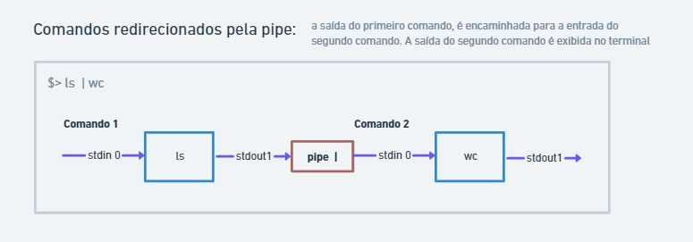
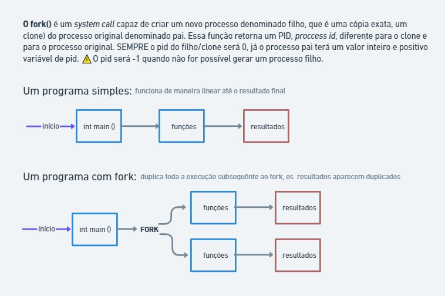
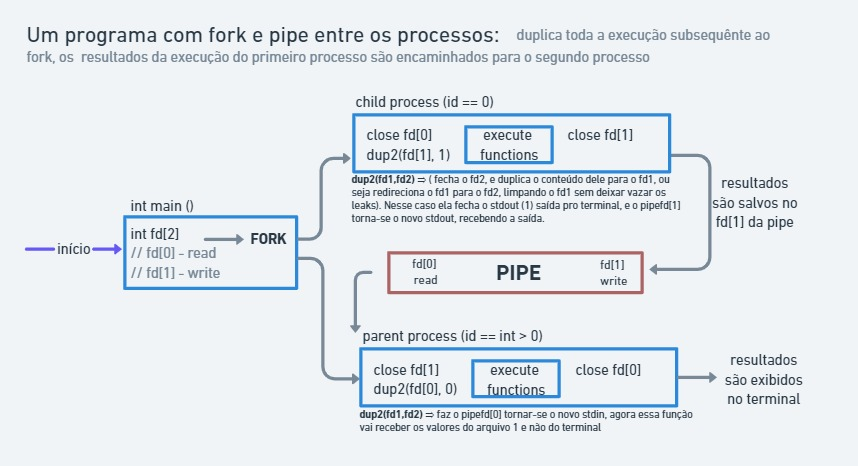
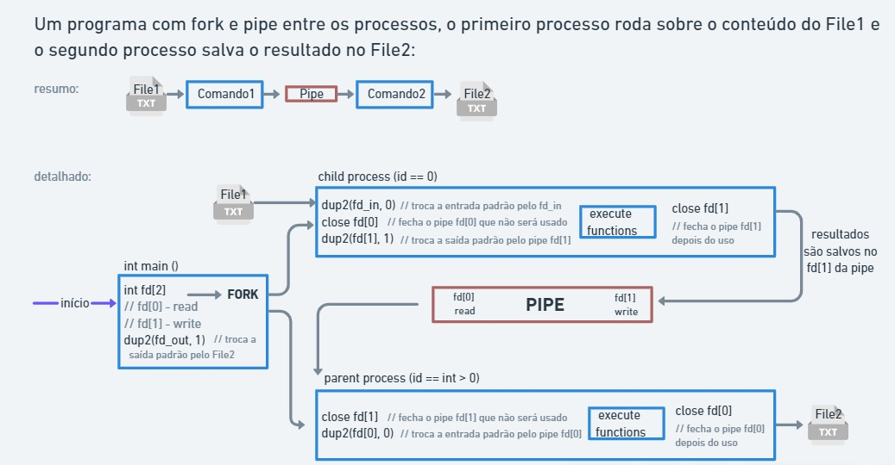

# Pipex Escola 42


## Como funciona a Pipe line |

Essa linha redireciona a saída de um comando para a entrada do próximo comando

ex: `ls | wc`
- o comando `ls`lista os arquivos e pastas no diretório atual
- o comando `wc`conta as palavras em um arquivo

então usando a pipe line redirecionamos a lista de arquivos para p comando contador, e teremos a quantidade de arquivos + pastas no diretório atual

### Entendendo os conceitos
`Input` - é o que eu estou recebendo, é a entrada de dados, é o caminho de entrada dos dados
`StdIn (0)` - é a entrada padrão de dados do terminal, toda vez que um comando é digitado no terminal ele estamos colocando o comando no StdIn (0) (Standard input) do terminal

`Output` - é o que eu estou renviando, é a saída dos dados que eu produzi, é o caminho de saída dos dados
`StdOut(1)` - saída normal do terminal, tudo que aparece escrito no terminal, foi enviado para o StdOut (1) (Standard outut) do terminal

`Erro` - quando algum comando é digitado errado, ou não encontrou o arquivo sobre o qual deveria rodar, essa info é enviada para uma saída pré definida para casos de erros
`Stderr (2)` - saída padrão para casos de erros

A saída do comando1, em vez de ir para o terminal, é encaminhada para a entrada do segundo comando

```
file1 -> stdin(0) -> comando 1  | comando 2 -> stdout(1) -> file2
                           |          |
                      stdout(1) -> stdin(0)
```

### Entendendo os conceitos
Base de estudo: man e https://www.youtube.com/playlist?list=PLfqABt5AS4FkW5mOn2Tn9ZZLLDwA3kZUY \
**Múltiplos processos:** Um processo (linha de execução de código) acontece duplicado toda vez que usamos um fork, um fork pode ser usado dentro de outro fork. Os processos pai e filho podem atuar diferentemente se as funções chamadas dentro de if que consultem o ID.

`Função fork`: ela duplica a linha de execução.... tudo o que for executado depois dela, será executado 2 vezes, cria variável duas vezes, aloca duas vezes... Faz com que um programa tenha 2 processos em execussão, um processo da main(processo pai), mais um processo criado pela bifurcação, clone exato do principal, (processo filho).\
`Retorno da função fork`: um int que será o ID do processo, para cada um dos processos: entao teremos um ID do processo pai, e um ID do processo filho. 
O ID do processo pai será um int positivo de valor variável (só será -1 se der errado o fork), o ID do processo filho *sempre será zero*.
Então: ID == 0 (processo filho)
       ID > 0 (processo pai)
       ID == -1 (falha no fork)

Sabendo o ID, pode-se pedir para cada processo executar uma função diferente, um dos processos pode até receber um segundo fork, e assim por diante.

`Função wait`: possibilita esperar o processo filho acabar para então executar o processo pai/main. Isso evita que os eventos ocorram simultâneamente, evitando que funções que imprimam coisas no terminal misturem a saída.

`Função pipe`: faz a comunicação entre os dois processos gerados pelo fork.\
A função pipe cria um canal de dados unidirecional que pode ser usado para comunicação entre os processos. A função pipe pede uma matriz de ints de 2 posições (int pipefd[2]). Essa matriz é usada para retornar dois descritores de arquivo referentes às extremidades do pipe. O pipefd[0] refere-se à extremidade lida e o pipefd[1] refere-se à extremidade de gravação do pipe. Os dados gravados na extremidade de gravação do pipe são armazenados em buffer pelo kernel até serem lidos na extremidade de leitura do pipe.\
pipefd[0] = é lido (O que tiver no pipefd[0] pode ser lido pelo pipefd[1 ])\
pipefd[1] = é escrito.\
`Retorno da função pipe`:Em caso de sucesso, zero é retornado. Em caso de erro, -1 é retornado, errno é definido para indicar o erro e o pipefd permanece inalterado. 

`Função dup e dup2`: a função dup `int dup(int old_fd)` duplica em um novo descritor de arquivo o que tinha no descritor de arquivo aberto antigo (old_fd) já aberto. O novo número do descritor de arquivo é garantido como o de menor número descritor de arquivo ainda não utilizado .\
A função dup2 `int dup2(int old_fd, int new_fd)`executa a mesma tarefa que dup (), mas
em vez de usar o descritor de arquivo não utilizado de menor número, ela usa o número do descritor de arquivo especificado em new_fd. Em outras palavras, o descritor de arquivo new_fd recebe uma duplicata do que havia no old_fd . \
O interesse do uso da dup2 nesse projeto se dá porque ela pode trocar os fds para stdin/stdout (essa func fecha o fd2, e duplica o conteúdo dele para o fd1, ou seja redireciona o fd1 para o fd2, limpando o fd1 sem deixar vazar os leaks).\
NO PROCESSO FILHO:
a dup2 fecha o stdout(1), e o pipefd[1] torna-se o novo stdout... ou seja o comando1 não vai mais mandar as infos do terminal, mas sim do pipefd[1]

`Função execv`: executa o programa referenciado pelo path. Essa função faz com que o programa que está sendo executado atualmente pelo no processo seja substituído por um novo programa, recém-inicializado. \
A família de funções exec permite o lançamento da execução de um programa externo ao processo. Não existe a criação efetiva de um novo processo, mas simplesmente uma substituição do programa de execução.\
Existem seis funções primitivas na família, as quais podem ser divididas em dois grupos: os execl(), para o qual o número de argumentos do programa lançado é conhecido; e os execv(), para o qual esse número é desconhecido. Em outras palavras, estes grupos  se diferenciam pelo número de parâmetros passados.
*O código do processo que chama uma função exec() será sempre destruído, e desta forma, não existe muito sentido em utilizá-la sem que ela esteja associada a uma primitiva fork().*
AQUI TEM EXEMPLOS : https://www.dca.ufrn.br/~adelardo/cursos/DCA409/node39.html

`Argumento env` passado por parâmetro para a main: env é um vetor de strings (char *env) na forma "nome=valor" que contém as `variáveis de ambiente` do shell que lançou a execução do programa (também finalizado por um ponteiro nulo). As variáveis de ambiente são cadeias de caracteres que contêm informações sobre o ambiente do sistema e sobre o usuário que está no momento conectado. Alguns programas de software usam as informações para determinar onde colocar arquivos (como por exemplo, os arquivos temporários).\
Uma variável de ambiente é um atalho (chamemos assim) para um valor que neste caso está disponível no ambiente de execução (neste caso no sistema operacional inteiro).

`PATH`: O PATH é uma variável do sistema usada pelo sistema operacional para localizar executáveis necessários da linha de comandos ou da janela do terminal. O PATH localiza executáveis que podem ser utilizados na CLI (Command Line Interface). $PATH: é uma variável do sistema Linux que indica trajetória (ou caminho) dos binários (executáveis dos programas), que podem ser executados sem indicar o caminho completo (geralmente muito longo) de onde eles estão.

`Função acess`: A função acces `int access(const char * pathname , int mode )` verifica se o processo de chamada pode acessar o arquivo pathname. O modo especifica a(s) verificação(ões) de acessibilidade a serem executadas. Os testes F_OK verificam a existência do arquivo. Já os testes R_OK , W_OK e X_OK, além da existencia, testam se o concede permissões de leitura, gravação e execução respectivamente.

### Processos

Em programação, um processo é uma instância de um programa em execução em um sistema operacional. Cada processo tem sua própria memória e espaço de endereçamento, e é geralmente executado em seu próprio ambiente isolado. Os processos geralmente interagem com outros processos através de mecanismos definidos pelo sistema operacional, como sinais, pipes e sockets. Nos sistemas operacionais tais como Windows e Linux muitos dos seus recursos operam sobre a forma de processos.

### Conectando os conceitos

Os comandos shell são instruções ou programas que podem ser executados em um ambiente de linha de comando ou terminal de um sistema operacional. Eles permitem que o usuário interaja com o sistema operacional e realizem tarefas, como navegar pelos diretórios, gerenciar arquivos, executar programas, manipular dados e configurar o ambiente do usuário. No geral, um comando é independente de outro comando.


A função pipe faz a comunicação entre os dois processos, encaminhando a saída de um para a entrada do outro.


O redirecionamento da saída de um comando para a entrada do próximo, faz com que o segundo comando opere sobre os dados fornecidos pela execussão do primeiro comando, e forneca um resultado a partir desses dados.

A função fork() é um system call capaz de criar um novo processo denominado filho, que é uma cópia exata do processo original denominado pai, e é uma técnica para poder dividir o trabalho. O fluxo é ramificado após a execução do fork, e é possível distiguir qual processo é qual pelo PID retornado a função fork. O processo filho tem o PID = 0, já o processo pai tem o PID = int < 0 (qualquer int maior que zero).



JUNTANDO O FORK COM A PIPE

Um programa com fork e pipe cria um novo processo, processo filho, usando a função fork() do sistema operacional. Esse processo filho é uma cópia exata do processo pai, mas com um identificador de processo (PID) diferente, e esse processo filho pode executar tarefas diferentes do processo pai.

O processo filho pode então redirecionar sua saída padrão (stdout) para uma pipe usando a função pipe() do sistema operacional. A pipe é um mecanismo de comunicação que permite que o processo filho envie dados para o processo pai. O processo pai pode ler a saída do processo filho a partir da pipe usando a função read() do sistema operacional. Os dados lidos pelo processo pai podem então ser processados ​​ou exibidos na saída padrão do processo pai.

Em resumo, a comunicação entre o processo filho e o processo pai é realizada através de uma pipe, que conecta a saída do processo filho à entrada do processo pai. O uso do fork e da pipe permite que o processo filho execute tarefas diferentes do processo pai e que a saída do processo filho seja lida e processada pelo processo pai.



Além de tudo isso, podemos usar um file_in de entrada para a execução do comando1(no processo filho), redirecionar a saída dessa execussão, pela pipe, para o comando2(no processo pai), e colocar a saída desse segundo processo no file_out. 



Essa imagem resume a arquitetura do meu projeto Pipex (existem muitas outras maneiras de fazer, e certamente outras serão até melhores). 